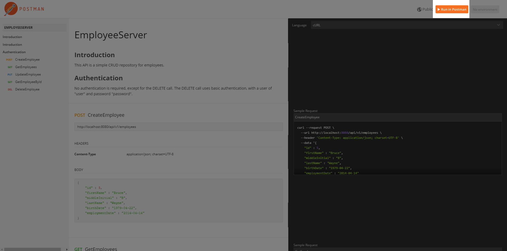

# employee-server
An example CRUD REST server for employees.  It's purpose is solely as an academic exercise and code sample.

## Dependencies
This server requires the use of [Java 1.8](http://www.oracle.com/technetwork/java/javase/downloads/jdk8-downloads-2133151.html) and [Maven](https://maven.apache.org/) to build and run.  The [pom.xml](https://github.com/MrRyanCramer/employee-server/blob/master/pom.xml) file will handle the rest of the dependencies mentioned below.
It leverages [Spring Boot](https://projects.spring.io/spring-boot/) for the web application backbone, [Spring Data JPA](https://projects.spring.io/spring-data-jpa/) for data access, [H2](http://www.h2database.com/html/main.html) for an in memory database, and [Jackson](https://github.com/FasterXML/jackson) for JSON parsing. 
## Build
1.  Clone the repository to your build environment.
1.  Run the maven package goal : `mvn package`
## Running the Server
The maven package goal creates an executable jar in the target folder by default.  Simply navigate to the folder containing the executable jar, and run the following command:  `java -jar employee-server-0.0.1.jar [JSON File Path]`
The first command line argument is an optional file path to a JSON file containing employees.  An example JSON file can be seen [here](https://github.com/MrRyanCramer/employee-server/blob/master/sampleData/employeeInput.json).  This JSON file, if provided, will populate the in memory database with the included employees.
## Interacting with the API
Documentation regarding the specific API calls has been published using Postman.  It can be found [here](https://documenter.getpostman.com/view/4274660/employeeserver/RW1dGdwL).  The calls in postman contain example data intended to work with the provided sample data.  To easily test the calls using Postman, the documentation provides a `Run in Postman` button in the top right corner as seen here:

A brief summary of the calls:

| HTTP Verb | Path | Description |
| --------- | ---- | ----------- |
| GET    | /api/v1/employees/{id} | Gets an active employee by the specified ID. |
| POST   | /api/v1/employees      | Creates a new employee based on a JSON request body |
| PUT    | /api/v1/employees/{id} | Updates the employee with the specified ID based on a JSON request body. |
| DELETE | /api/v1/employees/{id} | Acts as a delete function, by setting an employee's status to inactive if found.  *Requires a basic authentication user of "user" and password of "password"* |
| GET    | /api/v1/employees      | Get a list of all active employees. |

## Context
I thought it important to provide some additional project context.  This is an small academic exercise, not intended for production.  Given the goals and scope of the project, I specifically chose Spring Boot, Spring JPA, and Jackson as I had not worked with them before.  I chose in-memory H2 for simplicity.  With Spring JPA, it appears straightforward to change out the method of persistence.  It is also important to note some of the major areas I deemed out of scope:
* Security
  * To start, this implementation uses hardcoded fake user credentials and disables cors protection for convenience.
* Unit testing
* Robust error handling
